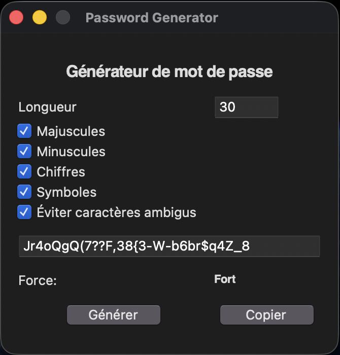

# Password Generator (Python GUI)

A simple cross-platform password generator with a clean graphical interface built using **Python** and **Tkinter**.  
It allows users to generate strong passwords with customizable options and copy them easily to the clipboard.

## Screenshot


## Features
- Custom password length
- Toggle character sets:
  - Uppercase letters
  - Lowercase letters
  - Digits
  - Symbols
- Option to avoid ambiguous characters (**O/0, I/l/1**)
- Simple password strength indicator (**Faible / Moyen / Fort**)
- One-click copy to clipboard (cross-platform via Tkinter)

## Tech Stack
- Python 3
- Tkinter (GUI)
- `secrets` module for cryptographically secure randomness

## Run Locally

### 1) Clone the repository
```bash
git clone https://github.com/elieldev23/password-generator.git
cd password-generator
```

### 2) Run the application
```bash
python3 src/app.py
```

> If you get a Tkinter error on Linux, install it with:
> ```bash
> sudo apt install python3-tk
> ```

## Project Structure
```text
password-generator/
  src/
    app.py
  assets/
    screenshot.png
  README.md
  LICENSE
  .gitignore
```

## Educational Goals
This project was built to practice:
- Python fundamentals
- GUI development with Tkinter
- Secure random generation
- Basic UX design
- Git & GitHub workflow

## Future Improvements (Ideas)
- Show / Hide password button
- Auto-copy on generation
- Password history
- Export passwords to an encrypted file
